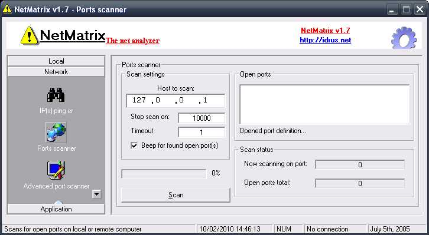



## NetMatrix

### Description

NetMatrix v1.6 | The Net Analyzer

1. What is NetMatrix? NetMatrix is a tool to help you analyze your network/LAN or even Internet. It has so many tools inside like port scanner, port sweeper, pinger, etc.

2. License. NetMatrix is freeware, free distributable, free copy, and free of charge.

3. Credits. Thanks to all of my friends who support me, my family, all tester, vbcode.com, planet-source-code.com, and you.

4. Contact

Author: Idrus Fhadli aka xvader

E-mail: fadly87@gmail.com

URL: http://idrus.net

Copyright (C) 2004/2005 - 2009, NeverHard!

Copyleft 2010, Sriwijaya-Empire.com | Now it apply the GNU General Public License version 2

Enjoy!!!
 
### More Info
 

             |
---                |---
**Submitted On**   |2006-08-02 00:45:36
**By**             |[xvader](https://github.com/Planet-Source-Code/PSCIndex/blob/master/ByAuthor/xvader.md)
**Level**          |Intermediate
**User Rating**    |5.0 (15 globes from 3 users)
**Compatibility**  |VB 6\.0
**Category**       |[Internet/ HTML](https://github.com/Planet-Source-Code/PSCIndex/blob/master/ByCategory/internet-html__1-34.md)
**World**          |[Visual Basic](https://github.com/Planet-Source-Code/PSCIndex/blob/master/ByWorld/visual-basic.md)
**Archive File**   |[NetMatrix2174582102010\.zip](https://github.com/Planet-Source-Code/xvader-netmatrix__1-72911/archive/master.zip)

